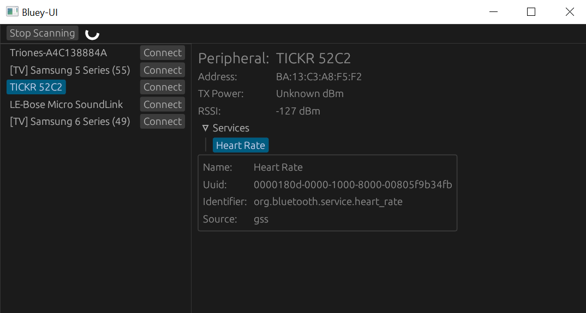
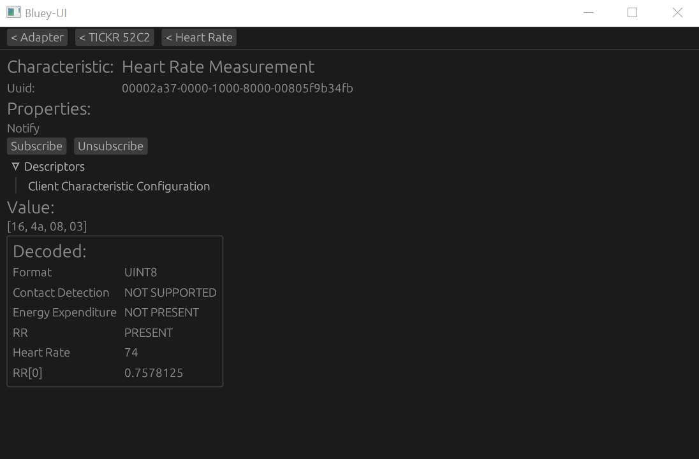

This is a minimal UI that can be used to scan for Bluetooth LE
peripherals and optionally connect to peripherals and browse
associated services, characteristics and descriptors.




# Building on Windows
```
cargo run --features=desktop
```

# Building on Android
```
export ANDROID_HOME="path/to/sdk"
export ANDROID_NDK_HOME="path/to/ndk"

rustup target add aarch64-linux-android
cargo install cargo-ndk

cargo ndk -t aarch64-linux-android -o app/src/main/jniLibs/  build
./gradlew build
./gradlew installDebug
```

## Permissions

Bluey-UI doesn't currently have support for requesting permissions
on Android which means that by default
when the application is first installed it won't have the required
location permissions to be able to start scanning for peripherals.
_(On Android bluetooth scanning is associated with fine location
permissions since it's theoretically possible to infer location
information from bluetooth devices found while scanning)_

For now it's necessary to go to the app info page for bluey-ui
after you first install it and manually toggle on the location
permission.

For reference, the Android backend for Bluey also supports discovering
peripherals via the Companion API which does not require location
permissions, and bluey-ui can be tweaked to use this but it's
currently not conveniently configurable, e.g. via a feature.

# Updating app/libs/bluey-debug.aar

For convenience this crate currently just has a pre-built aar
with the Java support classes of Bluey. To re-build this if
you've made changes to any of Bluey's Java code:

```
cd ../bluey/src/java
./gradlew build
cp build/outputs/aar/bluey-debug.aar ../../../bluey-ui/app/libs/
```